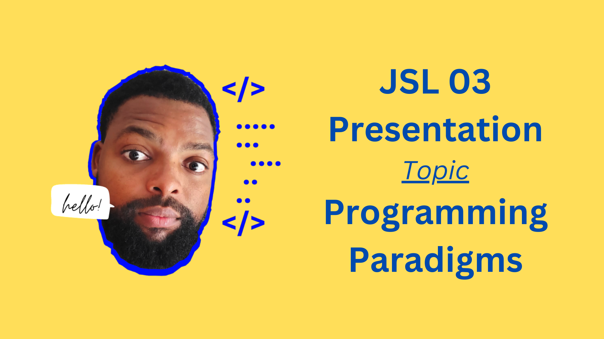
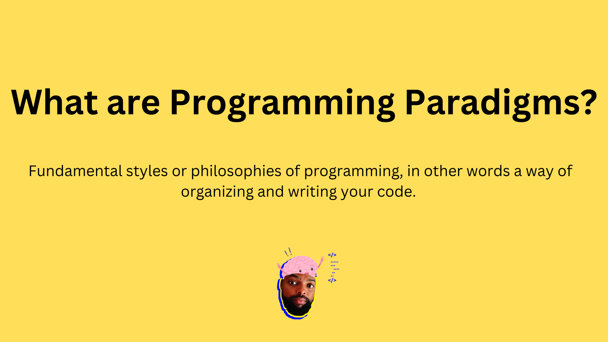
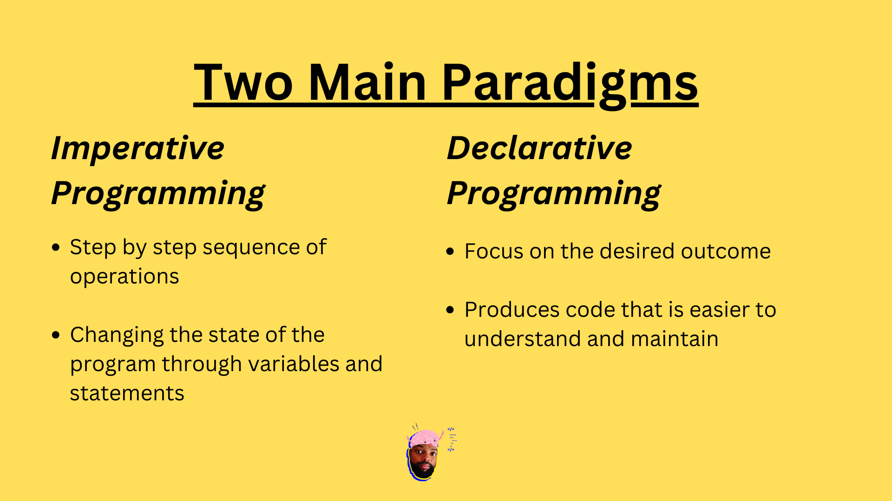
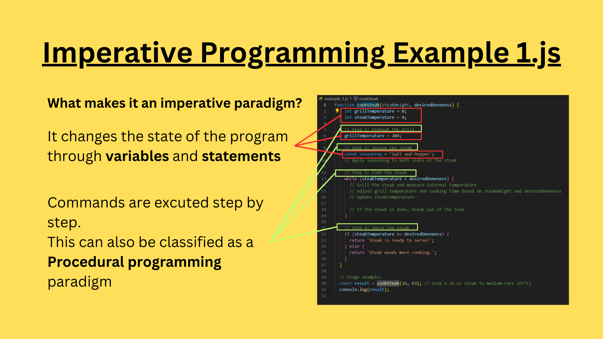
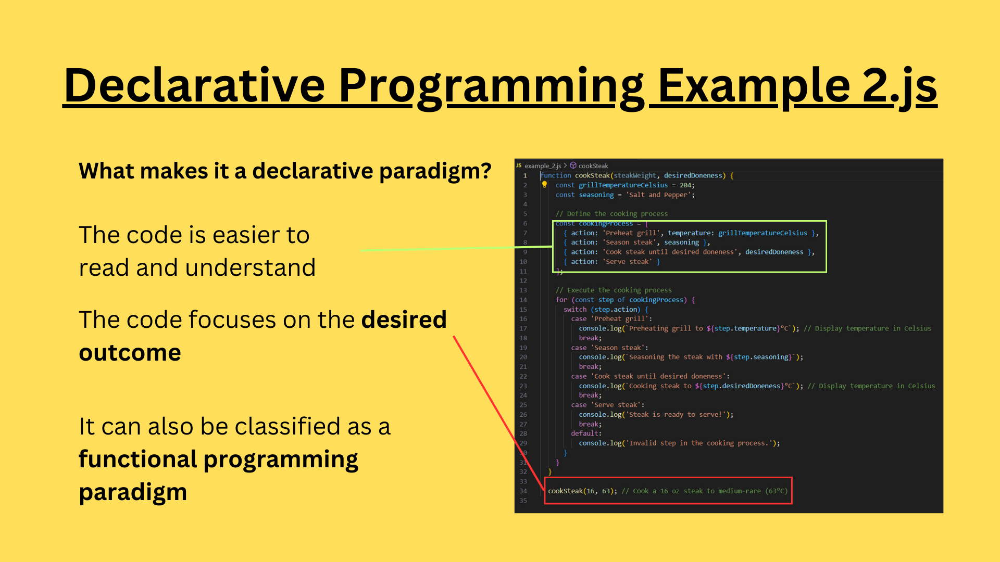
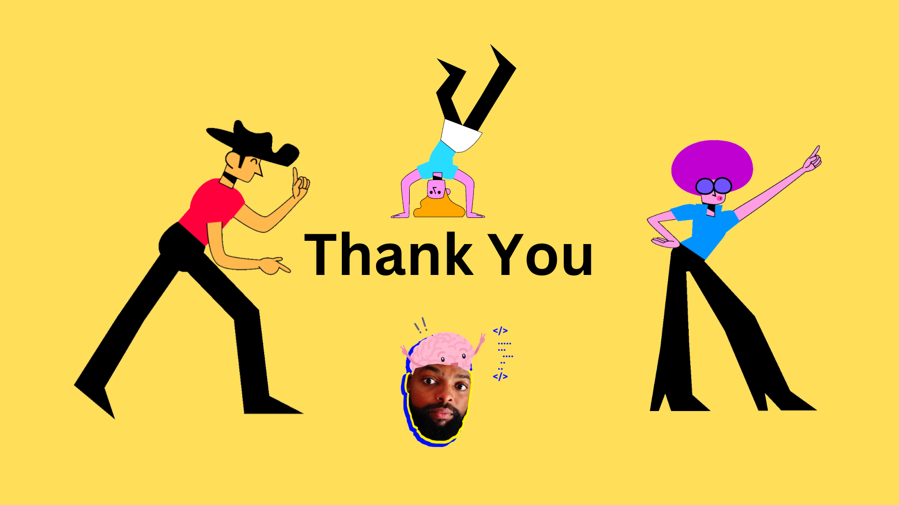

# Programming Paradigms

## Objective

- In this repo we look at two programmings that are written in two defferent style but do exactly the same thing.

## Loom Link:

https://www.loom.com/share/926baf483d304b9f808b18e0c50a9c1d?sid=ddc773a2-e07d-4412-9a5d-7067666eb894

## Presentation Slides

---

